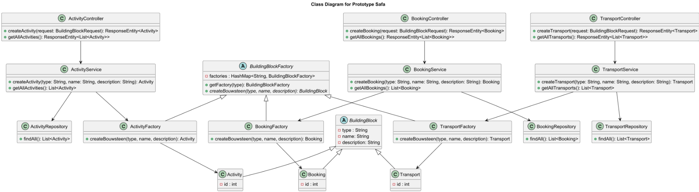

# Software Guidebook Triptop

## 1. Introduction

Dit software guidebook geeft een overzicht van de Triptop-applicatie. Het bevat een samenvatting van
het volgende:

1. De vereisten, beperkingen en principes.
2. De software-architectuur, met inbegrip van de technologiekeuzes op hoog niveau en de structuur
   van de software.
3. De ontwerp- en codebeslissingen die zijn genomen om de software te realiseren.
4. De architectuur van de infrastructuur en hoe de software kan worden geinstalleerd.

## 2. Context

### 2.1 Context Diagram

Toelichting op de context van de software inclusief System Context Diagram:

* De functionaliteit van de Trip Top webapplicatie is een software systeem dat reizigers helpt bij het plannen en boeken
  van hun reizen. Het systeem biedt een webapp waar gebruikers verschillende bouwstenen van hun reis
  kunnen combineren, zoals vervoer, accommodatie, excursies en overnachting.

* Onze software heeft 2 gebruikers: Een Reiziger en een Reis Agent
  * De Reiziger is de persoon die een reis plant en beheert.
  * De Reis Agent is de persoon die achter de schermen de Reiziger ondersteuning biedt.

* In onze context diagram maken we gebruik van verschillende externe systemen die we ondergedeeld hebben in verschillende providers.
  * Overnachting provider
    * Booking.com API
  * Vervoer provider
    * NS API 
    * Google Flights API
  * Excursie provider
    * Tripadvisor API
    * Get Your Guide API
  * Autoverhuurder provider
    * Sixt API
    * Hertz API
  * Eten en drinken provider
    * Takeaway API
    * Eet.nu API
  * Identiteits provider
    * Wiremock API

## 3. Functional Overview

Om de belangrijkste features toe te lichten zijn er user stories en twee domain stories gemaakt en
een overzicht van het domein in de vorm van een domeinmodel. Op deze plek staat typisch een user
story map maar die ontbreekt in dit voorbeeld.

### 3.1 User Stories

#### 3.1.1 User Story 1: Reis plannen

Als gebruiker wil ik een zelfstandig op basis van diverse variabelen (bouwstenen) een reis kunnen
plannen op basis van mijn reisvoorkeuren (wel/niet duurzaam reizen, budget/prijsklasse, 's nachts
reizen of overdag etc.) zodat ik op vakantie kan gaan zonder dat hiervoor een reisbureau benodigd
is.

#### 3.1.2 User Story 2: Reis boeken

Als gebruiker wil ik een geplande reis als geheel of per variabele (bouwsteen) boeken en betalen
zodat ik op vakantie kan gaan zonder dat hiervoor een reisbureau benodigd is.

#### 3.1.3 User Story 3: Reis cancelen

Als gebruiker wil ik een geboekte reis, of delen daarvan, kunnen annuleren zodat ik mijn geld terug
kan krijgen zonder inmenging van een intermediair zoals een reisbureau.

#### 3.1.4 User Story 4: Reisstatus bewaren

Als gebruiker wil ik mijn reisstatus kunnen bewaren zonder dat ik een extra account hoef aan te
maken zodat ik mijn reis kan volgen zonder dat ik daarvoor extra handelingen moet verrichten.

#### 3.1.5 User Story 5: Bouwstenen flexibel uitbreiden

Als gebruiker wil ik de bouwstenen van mijn reis flexibel kunnen uitbreiden met een zelf te managen
stap (bijv. met providers die niet standaard worden aangeboden zoals een andere reisorganisatie,
hotelketen etc.) zodat ik mijn reis helemaal kan aanpassen aan mijn wensen.

### 3.2 Domain Story Reis Boeken (AS IS)

### 3.3 Domain Story Reis Boeken (TO BE)

### 3.4 Domain Model

## 4. Quality Attributes

Voordat deze casusomschrijving tot stand kwam, heeft de opdrachtgever de volgende ISO 25010
kwaliteitsattributen benoemd als belangrijk:

* Compatibility -> Interoperability (Degree to which a system, product or component can exchange
  information with other products and mutually use the information that has been exchanged)
* Reliability -> Fault Tolerance (Degree to which a system or component operates as intended despite
  the presence of hardware or software faults)
* Maintainability -> Modularity (Degree to which a system or computer program is composed of
  discrete components such that a change to one component has minimal impact on other components)
* Maintainability -> Modifiability (Degree to which a product or system can be effectively and
  efficiently modified without introducing defects or degrading existing product quality)
* Security -> Integrity (Degree to which a system, product or component ensures that the state of
  its system and data are protected from unauthorized modification or deletion either by malicious
  action or computer error)
* Security -> Confidentiality (Degree to which a system, product or component ensures that data are
  accessible only to those authorized to have access)

## 5. Constraints
### Hoeft niet

// TODO
## 6. Principles

Quinn: Dependency Inversion Principle (DIP)
Safa: Open Closed Principle (OCP)
Rick: Open Closed Principle (OCP)

> [!IMPORTANT]
> Beschrijf zelf de belangrijkste architecturele en design principes die zijn toegepast in de
> software.

// TODO
## 7. Software Architecture

### 7.1. Containers

> [!IMPORTANT]
> Voeg toe: Container Diagram plus een Dynamic Diagram van een aantal scenario's inclusief
> begeleidende tekst.

### 7.2. Components

> [!IMPORTANT]
> Voeg toe: Component Diagram plus een Dynamic Diagram van een aantal scenario's inclusief
> begeleidende tekst.

### 7.3. Design & Code

**Ontwerpvraag Rick:** Hoe kunnen we het systeem uitbreiden met nieuwe types activiteiten of excursies zonder de bestaande code te veranderen?

**Ontwerpvraag Quinn:** Hoe kunnen verschillende boekingsservices (zoals Booking.com en eigen beheer in Triptop) worden geïntegreerd?

Op het moment dat een reiziger een boeking wil doen roept hij/zij de BoekingController aan. De reiziger geeft een stad, aankomstdag en vertrekdag door en de controller roept in nieuweBoeking de boekingService aan. Die bevat een lijst van adapters en selecteert de gekozen adapter. Vervolgens wordt een van de adapters aangeroepen die dan via de Service connectie maakt met de API. 
De data die uit de API wordt opgehaald, wordt teruggestuurd en getoond aan de gebruiker.

**Ontwerpvraag Safa** Hoe maak je de applicatie uitbreidbaar met nieuwe bouwstenen? 

> [!IMPORTANT]
> Voeg toe: Per ontwerpvraag een Class Diagram plus een Sequence Diagram van een aantal scenario's inclusief begeleidende tekst.

## 8. Architectural Decision Records

### 8.1. API-verbindingsstrategie

**Datum:** 2025-03-21

#### Context

Bij het integreren van externe APIs in een applicatie moet je goed nadenken over waar de aanroepen
plaatsvinden: aan de kant van de **frontend**, de **backend**, of een combinatie van beide. Deze
keuze heeft invloed op de beveiliging (_confidentiality_), prestaties (_performance_) en controle
over hoe de applicatie werkt.

In het geval van Triptop werken we met verschillende externe diensten, zoals Booking.com, NS API,
KLM, en identity providers zoals Google. Daarom is het belangrijk om bewust te kiezen waar de
externe communicatie plaatsvindt in onze architectuur.

---

#### Considered Options

### 1. API-aanroepen direct vanuit de frontend

- **Voordelen:**
    - Snelle interactie voor de gebruiker
    - Minder belasting op de backend
- **Nadelen:**
    - CORS-problemen (sommige APIs staan geen frontend-verkeer toe)
    - Minder grip op foutafhandeling en logging
    - Beperkte controle over validatie van gegevens

### 2. API-aanroepen via de backend

- **Voordelen:**
    - Betere controle over datavalidatie, caching en foutafhandeling
    - Geen CORS-issues
    - Logging kan centraal worden geregeld
- **Nadelen:**
    - Meer netwerkverkeer via de backend
    - Mogelijk iets langere responstijden

---

#### Decision

Voor deze casus is besloten dat **alle externe API-aanroepen via de backend verlopen**.

Hierdoor hebben we meer controle over hoe externe services worden aangeroepen, kunnen we
foutmeldingen en uitzonderingen beter afvangen, en voorkomen we afhankelijkheid van wat er allemaal
in de browser gebeurt. Ook kunnen we centraal loggen en valideren, wat handig is bij het
troubleshooten of monitoren van de applicatie.

---

#### Status

**Status:** Accepted

#### Consequences

- **Meer controle:** De backend fungeert als centrale laag waar foutafhandeling, validatie en
  logging plaatsvinden.
- **Geen CORS-problemen:** Omdat alles via de backend loopt, zijn er geen beperkingen door
  browserbeveiliging.
- **Hogere belasting op de backend:** Alle API-verzoeken lopen via onze servers, wat meer resources
  kost.
- **Iets meer vertraging mogelijk:** Doordat alles via de backend loopt, is er iets meer latency.

Deze aanpak ondersteunt vooral de kwaliteitseis **Confidentiality**. In de toekomst kan dit worden
herzien als bepaalde externe services andere eisen of mogelijkheden bieden.

### 8.2. API Data Validatie en Opslagstrategie

**Datum:** 2025-03-21

#### Context

Bij het gebruik van externe APIs in onze applicatie is het belangrijk dat we controleren of de data
die we binnenkrijgen ook daadwerkelijk past binnen ons domeinmodel. Denk hierbij aan het controleren
van datatypes, verplichte velden, en of de structuur overeenkomt met wat ons systeem verwacht. Dit
voorkomt fouten bij het gebruik van deze data in de applicatie of bij het opslaan ervan.

Daarnaast willen we bewust omgaan met het opslaan van data: wat slaan we op in onze eigen database,
en wat kunnen we beter ophalen op het moment dat het nodig is? Het doel hiervan is om onnodige
opslag te vermijden en alleen data te bewaren die relevant is voor de werking van onze applicatie.

In het kader van **modifiability** en **data-integriteit** is het niet wenselijk om klakkeloos alles
op te slaan. Wanneer we bijvoorbeeld wisselende of snel verouderende data zoals actuele prijzen of
beschikbaarheid opslaan, lopen we het risico dat die data niet meer klopt. We willen dus alleen
opslaan wat essentieel is, stabiel is, of moeilijk opnieuw op te halen is.

---

#### Considered Options

### 1. Alle data opslaan in de database

- **Voordelen:**
    - Alles is lokaal beschikbaar voor latere uitbreiding
    - Minder afhankelijk van externe services bij gebruik
- **Nadelen:**
    - Onnodige belasting op opslag
    - Risico op verouderde of dubbele gegevens
    - Grotere kans op inconsistentie tussen opgeslagen data en de actuele data bij de bron

### 2. Alleen essentiële data opslaan

- **Voordelen:**
    - Minder opslagcapaciteit nodig
    - Minder kans op inconsistente data
    - Flexibeler systeem dat minder afhankelijk is van vaste datamodellen
- **Nadelen:**
    - Externe API moet soms alsnog real-time worden geraadpleegd
    - Mogelijk meer netwerkverkeer en vertraging bij ophalen van aanvullende gegevens

### 3. Data alleen cachen (tijdelijk bewaren)

- **Voordelen:**
    - Snelle toegang tot veelgebruikte data zonder dat het permanent opgeslagen wordt
    - Handig voor gegevens die vaak opgevraagd worden, maar snel kunnen veranderen
- **Nadelen:**
    - Data kan vervallen of verouderd zijn, cache moet goed beheerd worden
    - Bij verversing van de cache kan belangrijke informatie verloren gaan als er geen
      fallback-mechanisme is

---

#### Decision

We kiezen ervoor om **alleen essentiële data op te slaan**. Hierdoor blijft de database
overzichtelijk en efficiënt ingericht. Niet-essentiële of snel veranderende informatie wordt alleen
opgevraagd op het moment dat het nodig is, bijvoorbeeld bij het tonen van details of bij het
afronden van een boeking.

Bijvoorbeeld: in het geval van overnachtingen slaan we alleen basisgegevens op zoals locatie, naam,
prijsindicatie en ID. Extra informatie zoals foto's, reviews of precieze beschikbaarheid wordt
opgehaald via de betreffende externe API.

---

#### Status

**Status:** Accepted

---

#### Consequences

- **Efficiënte opslag**: Alleen de data die nodig is wordt bewaard, waardoor de database
  overzichtelijk blijft. Dit maakt onderhoud en query’s eenvoudiger.
- **Veiliger systeem**: Minder gevoelige data opgeslagen betekent minder risico bij datalekken. Denk
  hierbij aan gebruikersdata of reserveringsinformatie die we beter niet onnodig bewaren.
- **Afhankelijkheid van externe APIs**: Als de API niet beschikbaar is, kan bepaalde data tijdelijk
  niet getoond worden. Dit vereist goede fallback-logica of duidelijke meldingen aan de gebruiker.
- **Extra latency mogelijk**: Soms is een extra API-aanroep nodig om ontbrekende info op te halen.
  Dit kan invloed hebben op de snelheid van bepaalde onderdelen van de applicatie, vooral bij
  meerdere opeenvolgende API-aanroepen.

### 8.3. ADR: Gebruik van Factory Method voor uitbreidbare bouwstenen

**Datum:** 2025-03-21

#### Context

Binnen het Triptop-project willen we een systeem ontwerpen waarin gebruikers hun reis kunnen
opbouwen uit verschillende bouwstenen, zoals overnachtingen, vervoer, excursies, enzovoort. Eén van
de belangrijkste eisen is dat dit systeem **gemakkelijk uitbreidbaar** moet zijn met nieuwe soorten
bouwstenen in de toekomst, zonder dat bestaande code herschreven hoeft te worden.

We willen deze uitbreidbaarheid op een nette, onderhoudbare manier realiseren. Dit betekent: lage
koppeling tussen componenten, herbruikbaarheid van code, en het vermijden van duplicatie.

Deze ontwerpbeslissing speelt zich af in de context van het quality attribute **modifiability**,
waarbij het belangrijk is dat nieuwe functionaliteit eenvoudig toegevoegd kan worden, zonder
bestaande logica te breken of te herschrijven.

---

#### Considered Options

We hebben verschillende design patterns overwogen om deze uitbreidbaarheid te realiseren:

- **State Pattern**: Dit patroon is vooral handig voor het beheren van toestanden binnen een object.
  Hoewel nuttig voor statusbeheer, biedt het weinig voordelen bij het toevoegen van compleet nieuwe
  bouwstenen.

- **Strategy Pattern**: Zeer geschikt voor het verwisselen van algoritmes of gedrag op runtime. Dit
  patroon helpt bij het variëren van gedrag, maar richt zich niet direct op het aanmaken van nieuwe
  objecten of bouwstenen.

- **Adapter Pattern**: Dit patroon is waardevol voor integratie met externe APIs die een ander
  formaat of interface gebruiken. Het ondersteunt interoperabiliteit, maar niet specifiek de creatie
  van nieuwe domeinobjecten.

- **Facade Pattern**: Dit patroon maakt een subsysteem eenvoudiger te gebruiken door een
  vereenvoudigde interface aan te bieden. Het is nuttig voor gebruiksgemak, maar biedt weinig
  ondersteuning voor uitbreidbare objectcreatie.

- **Factory Method Pattern**: Dit patroon biedt een manier om objecten te creëren zonder direct
  afhankelijk te zijn van hun concrete klassen. Nieuwe objecttypen kunnen eenvoudig toegevoegd
  worden door een subklasse toe te voegen zonder de bestaande fabriek of clientcode aan te passen.

---

#### Decision

We kiezen voor het **Factory Method Pattern** om de creatie van bouwstenen te structureren. Dit
maakt het mogelijk om nieuwe typen bouwstenen (zoals bijvoorbeeld een 'Wellness-arrangement' of '
Lokale gids') toe te voegen zonder bestaande code te hoeven aanpassen.

We implementeren een centrale `BouwsteenFactory`, die bepaalt welk type object wordt aangemaakt op
basis van input (bijvoorbeeld type, locatie of ID). Elke bouwsteensoort krijgt zijn eigen klasse die
een gedeelde interface implementeert. Deze aanpak sluit goed aan op onze behoefte aan flexibiliteit
en schaalbaarheid.

---

#### Status

**Status:** Accepted

---

#### Consequences

De keuze voor het Factory Method Pattern heeft de volgende gevolgen:

- **Positief**:
    - De applicatie wordt makkelijker uit te breiden met nieuwe bouwstenen.
    - We houden de codebase modulair en overzichtelijk.
    - Bestaande functionaliteit blijft intact bij uitbreidingen.

- **Negatief**:
    - Er moet voor elke nieuwe bouwsteensoort een aparte klasse worden gemaakt.
    - De introductie van extra abstracties (zoals een interface en subklassen) kan de leercurve voor
      nieuwe ontwikkelaars iets verhogen.

Al met al wegen de voordelen van flexibiliteit, loskoppeling en onderhoudbaarheid zwaarder dan de
extra complexiteit.

---

#### Bronnen

- [Refactoring Guru – Factory Method](https://refactoring.guru/design-patterns/factory-method)
- [Software-Design-Patterns.pptx (SOEX)](https://aim-ene.github.io/soex/assets/files/Software-Design-Patterns-0d2fdea120bb6494d39f949233e45cc5.pptx)

### 8.4. ADR-004: Integratie van boekingsservices via Adapter Pattern

**Datum:** 2025-03-21

#### Context

Triptop integreert meerdere boekingsservices, waaronder Booking.com en interne boekingssystemen. Elk
van deze services heeft een eigen API-structuur, manier van communiceren en formaat van gegevens.
Deze verschillen zorgen voor technische complexiteit in de applicatie, zeker wanneer we meerdere
diensten willen ondersteunen die niet dezelfde interface of response-structuur hanteren.

Daarnaast is het belangrijk dat we in de toekomst eenvoudig nieuwe boekingsservices kunnen
toevoegen, zonder bestaande code te breken of aan te passen. De oplossing moet dus uitbreidbaar zijn
én zorgen voor duidelijke scheiding tussen interne logica en externe systemen. Deze context speelt
zich af binnen het quality attribute **interoperability**, maar raakt ook aan **modifiability**.

---

#### Considered Options

We hebben verschillende design patterns overwogen om dit probleem op te lossen:

- **State Pattern**: Dit patroon richt zich vooral op het beheren van de interne status van een
  object. Hoewel handig voor het regelen van toestandsveranderingen, biedt het weinig ondersteuning
  voor het integreren van externe services.

- **Strategy Pattern**: Dit patroon maakt het mogelijk om verschillende algoritmes uitwisselbaar toe
  te passen. Het is nuttig wanneer verschillende logica gekozen moet worden op runtime, maar niet
  specifiek gericht op integratie van systemen met een verschillende interface.

- **Adapter Pattern**: Dit patroon maakt het mogelijk om klassen met een ander interface tóch te
  laten samenwerken. Voor elke externe boekingsservice kan een adapter worden gemaakt die een
  gemeenschappelijk interface implementeert. Zo kunnen we intern werken met een eenduidige
  structuur, terwijl de externe verschillen worden afgevangen.

- **Facade Pattern**: Dit patroon biedt één vereenvoudigde toegang tot een complex subsysteem.
  Hoewel het de leesbaarheid verhoogt, lost het het probleem van verschillende interfaces niet op.

- **Factory Method**: Een patroon gericht op het flexibel aanmaken van objecten. Het zou deels
  toepasbaar kunnen zijn, maar biedt minder directe voordelen voor het transformeren of aanpassen
  van inkomende dataformaten.

---

#### Decision

We hebben besloten om het **Adapter Pattern** toe te passen voor de integratie van verschillende
boekingsservices. Iedere externe service krijgt een eigen adapterklasse die een gedeelde interface
implementeert, bijvoorbeeld `IBookingServiceAdapter`. De interne logica van Triptop werkt
uitsluitend met deze interface, en hoeft daardoor niet te weten hoe de onderliggende service precies
werkt.

Op deze manier kunnen we makkelijk een nieuwe boekingsservice toevoegen door alleen een nieuwe
adapter te schrijven, zonder dat we bestaande logica of klassen hoeven aan te passen. Dit maakt de
applicatie onderhoudbaar én uitbreidbaar.

---

#### Status

Accepted

---

#### Consequences

Door deze keuze kunnen we externe systemen integreren zonder afhankelijk te zijn van hun specifieke
structuur of gedrag. Dit zorgt voor:

- **Positieve gevolgen**:
    - Nieuwe boekingsservices kunnen eenvoudig toegevoegd worden.
    - De interne code blijft schoon, overzichtelijk en losgekoppeld van externe APIs.
    - De leesbaarheid van de code verbetert doordat alle services via een gestandaardiseerde
      interface worden aangesproken.

- **Negatieve gevolgen**:
    - Voor elke nieuwe service moet een aparte adapter geschreven en onderhouden worden.
    - Bij grote verschillen tussen externe services kan de adaptercomplexiteit toenemen.
    - Er ontstaat mogelijk een grotere hoeveelheid klassen die beheerd moeten worden.

Toch wegen de voordelen zwaarder dan de nadelen, zeker gezien de schaalbaarheid en flexibiliteit die
dit patroon ons biedt.

---

#### Bronnen

- [Refactoring Guru – Adapter Pattern](https://refactoring.guru/design-patterns/adapter)
- [Software-Design-Patterns.pptx – SOEX](https://aim-ene.github.io/soex/assets/files/Software-Design-Patterns-0d2fdea120bb6494d39f949233

## 8.5. ADR: Verkenning van het Strategy Pattern voor vervoer tussen overnachtingen

#### Status

In onderzoek — 28 maart 2025  
**Auteur:** Rick Schoenmaker  
**Onderdeel van:** Les 3 – Vervoer tussen Overnachtingen (Triptop)

---

#### Context

Triptop is een applicatie waarmee gebruikers hun vakantietrip kunnen samenstellen. Een essentieel
onderdeel hiervan is het plannen van vervoer tussen overnachtingen. Gebruikers moeten kunnen kiezen
uit verschillende vervoersopties zoals auto, trein, vliegtuig of boot.

Elke vervoersvorm heeft zijn eigen logica voor het berekenen van routes, prijzen en het boeken van
tickets. Deze verschillen maken het lastig om alle vormen op één uniforme manier te behandelen in de
code.

Het systeem moet bovendien goed onderhoudbaar zijn, makkelijk uit te breiden met nieuwe vormen van
transport, en eenvoudig te testen. We zoeken daarom een architectuuroplossing die voldoet aan de
kwaliteitsattributen **modifiability**, **scalability** en **testability**.

---

#### Considered Options

### Optie 1: Strategy Pattern met een `TransportOption` interface

In deze optie wordt een interface (`TransportOption`) geïntroduceerd die de gedeelde functies van
transport vastlegt, zoals `getRoute()`, `getPrice()` en `book()`. Elke concrete vervoersoptie (zoals
`CarTransport`, `TrainTransport`, `BoatTransport`) implementeert deze interface.

De `TransportPlanner` maakt gebruik van deze interface en werkt via polymorfisme met het juiste
vervoertype.

**Voordelen:**

- Ondersteunt het *Open/Closed Principle*: nieuwe vervoersvormen kunnen toegevoegd worden zonder
  bestaande code aan te passen.
- Maakt gebruik van het *Dependency Inversion Principle*: de planner is niet afhankelijk van
  concrete implementaties.
- Makkelijk te testen met behulp van mocks of stubs van de interface.
- Verhoogt herbruikbaarheid en flexibiliteit van de code.

**Nadelen:**

- Vereist een extra abstractielaag (de interface).
- De keuze van de juiste strategie (welk type transport) moet elders bepaald worden, bijvoorbeeld
  via een factory of configuratiebestand.

---

### Optie 2: `if`/`switch`-constructies binnen `TransportPlanner`

In deze aanpak bevat de `TransportPlanner` zelf alle logica en bepaalt via `if`- of `switch`
-statements welk vervoertype gebruikt wordt.

**Voordelen:**

- Snel te implementeren voor eenvoudige of tijdelijke oplossingen.

**Nadelen:**

- Schendt het *Single Responsibility Principle* en *Open/Closed Principle*.
- Moeilijk onderhoudbaar bij uitbreiding (bijvoorbeeld nieuwe vervoersopties).
- Lastig testbaar per vervoersvorm omdat de logica samengevoegd is.
- Zorgt voor een starre architectuur en herhaling van code.

---

### Optie 3: Factory Pattern gecombineerd met interface

Deze optie gebruikt een `TransportFactory` die op basis van invoer (bijvoorbeeld gebruikerskeuze of
data) het juiste `TransportOption` object teruggeeft. De factory werkt samen met het Strategy
Pattern om de juiste implementatie in te zetten.

**Voordelen:**

- Duidelijke scheiding tussen objectcreatie en gebruik.
- Makkelijk uitbreidbaar met nieuwe vervoersopties.
- Logica over strategie-keuze zit op één centrale plek.

**Nadelen:**

- Iets complexer qua opzet en beheer.
- De factory moet goed geconfigureerd worden (bijvoorbeeld met registraties of mappings).

---

#### Decision

We geven de voorkeur aan **Optie 1: het Strategy Pattern met een gedeelde `TransportOption`
interface**. Dit patroon maakt het mogelijk om flexibel met meerdere vervoersopties om te gaan,
zonder directe afhankelijkheid van concrete klassen.

Elke vervoersvorm kan geïsoleerd worden ontwikkeld, getest en uitgebreid. De `TransportPlanner`
blijft hierdoor schoon, overzichtelijk en toekomstbestendig. In een latere fase kan dit eventueel
gecombineerd worden met een Factory voor automatische selectie van de juiste strategie.

---

#### Consequences

- **Uitbreidbaar**: Nieuwe vervoersopties kunnen eenvoudig worden toegevoegd zonder aanpassingen aan
  bestaande klassen.
- **Testbaar**: Iedere transportstrategie is afzonderlijk te testen.
- **Flexibel en onderhoudbaar**: Geen `if`/`switch`-blokken, en duidelijke scheiding van
  verantwoordelijkheden.
- **Complexiteit**: Iets meer code nodig door extra interface en implementatieklassen.
- **Strategiekeuze**: Er is aanvullende logica nodig om de juiste strategie te kiezen op basis van
  invoer (bijv. gebruikersvoorkeuren of bestemming).

---

#### Bronnen

- [Refactoring Guru – Strategy Pattern](https://refactoring.guru/design-patterns/strategy)
- [Software-Design-Patterns.pptx – SOEX](https://aim-ene.github.io/soex/assets/files/Software-Design-Patterns-0d2fdea120bb6494d39f949233e45cc5.pptx)

## 9. Deployment, Operation and Support

> [!TIP]
> Zelf beschrijven van wat je moet doen om de software te installeren en te kunnen runnen.