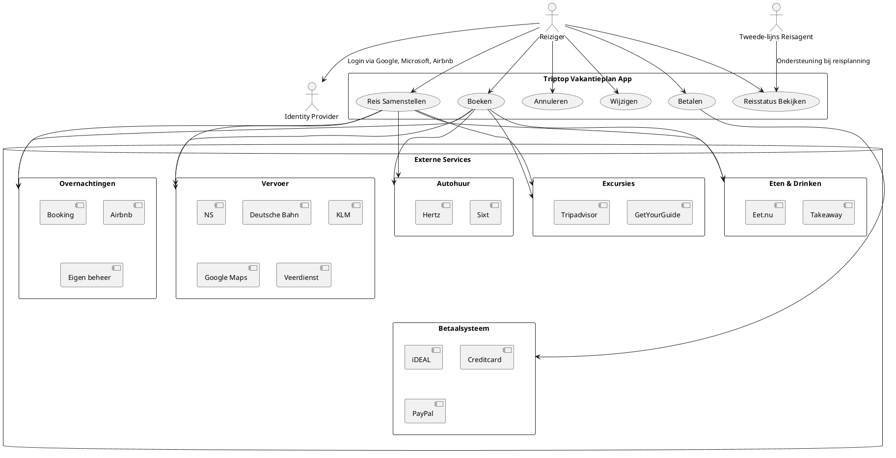

To make the diagram more advanced and reduce line crossings, we can rearrange the elements and use different types of connectors. Here is an updated version of the PlantUML diagram:

This version organizes the external services into nested rectangles to reduce line crossings and improve readability.